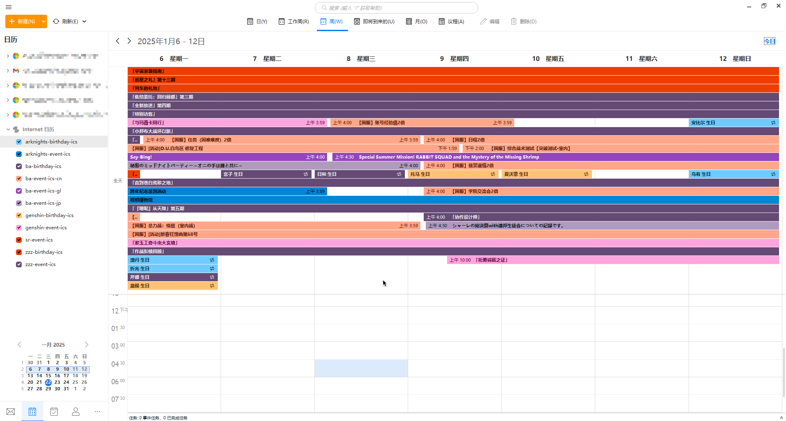

# anything-ics
[English](README.md) | [简体中文](README.zh-CN.md)

    
    
Just like this

This project is merged from other small repositories and will support generating more ICS files in the future. You are welcome to expand your own content following the project's existing structure.\
The outputs will be regularly updated by Actions.\
What is [ICS](https://en.wikipedia.org/wiki/ICalendar)?\
JSON version of the data is also provided, just replace `.ics` with `.json` in the subscription URL. The definition can be found in `type/ReleaseJsonType.ts` of the corresponding module in `src`.

## Currently Supported
- Genshin Impact Birthday (gi-birthday)
- Genshin Impact Events (gi-event)
- Honkai: Star Rail Events (sr-event)
- Zenless Zone Zero Birthday (zzz-birthday)
- Zenless Zone Zero Events (zzz-event)
- Arknights Birthday (ark-birthday)
- Arknights Events (ark-event)
- Blue Archive Birthday (ba-birthday)
- Blue Archive JP Events (ba-event-jp)
- Blue Archive Global Events (ba-event-gl)
- Blue Archive CN Events (ba-event-cn)

 

If the content you want is not in the supported list, you can:
- Submit an Issue to let me know
- Submit a PR (please refer to "Steps for Submitting PR" below)

## How to Use
1. First, determine your subscription URL by selecting the content you want to subscribe to from the "Currently Supported" list above and copying the name in parentheses.
2. Append the name to `https://avgt.ink/ics/<name>.ics`, for example: `https://avgt.ink/ics/gi-birthday.ics`.
3. Enter it in different positions according to different software, see [Wiki](https://github.com/SmallZombie/anything-ics/wiki) for details.

⚠️ If your network environment cannot access `github.io`, please use `proxy.avgt.ink`. The complete link would look like this: `https://proxy.avgt.ink/ics/gi-birthday.ics`.\
⚠️ If the link is not working, please use issues to remind me.

## Steps for Submitting PR
1. Fork this repository
2. Choose a name for your module and create a directory for it under `src`
3. Write your data fetching and updating logic by referring to existing modules
    - For file save paths, please use `BaseUtil.PathHelper`
    - Check all classes and methods in `BaseUtil`, or refer to other modules' implementations
4. Add a task for it in `deno.json`, the task name should match the module name
5. Test your task
6. Write automation task for it in `.github/workflows/daily-update.yml`
7. Create Pull request
