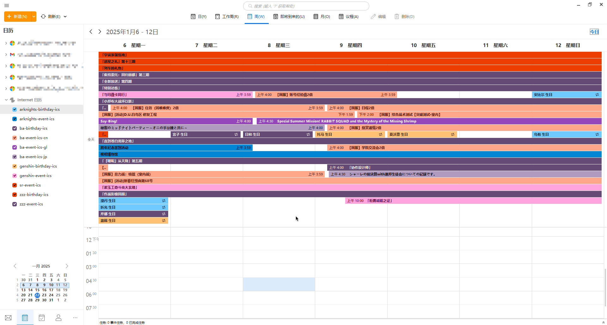

# anything-ics
[English](README.md) | [简体中文](README.zh-CN.md)

    
    
这盛世如你所愿.jpg

本项目由其他小仓库合并而来，未来也将支持生成更多的 ics 文件，欢迎按照项目现有结构扩充自己的内容。\
产物将由 Actions 定期更新。\
什么是 [ICS](https://en.wikipedia.org/wiki/ICalendar)？\
也提供 json 版的数据，只需将订阅地址的 `.ics` 换成 `.json` 即可，定义见 `src` 内对应模块的 `type/ReleaseJsonType.ts`。

## 目前支持
- 原神生日 (gi-birthday)
- 原神活动 (gi-event)
- 崩坏星穹铁道活动 (sr-event)
- 绝区零生日 (zzz-birthday)
- 绝区零活动 (zzz-event)
- 明日方舟生日 (ark-birthday)
- 明日方舟活动 (ark-event)
- 蔚蓝档案生日 (ba-birthday)
- 蔚蓝档案日服活动 (ba-event-jp)
- 蔚蓝档案国际服活动 (ba-event-gl)
- 蔚蓝档案国服活动 (ba-event-cn)

## 如何使用
1. 首先需要确定你的订阅地址，在上方目前支持中选择要订阅的内容并复制后面括号里的名字。
2. 将名字拼接到 `https://avgt.ink/ics/<name>.ics` 中，拼接好后就像这样：`https://avgt.ink/ics/gi-birthday.ics`。
3. 根据不同的软件填入不同的位置，详见 [本仓库Wiki](https://github.com/SmallZombie/anything-ics/wiki)。

如果短链接无法使用，请尝试将订阅地址拼接为 `https://smallzombie.github.io/anything-ics/release/<name>.ics`，并使用 Issues 提醒我。
